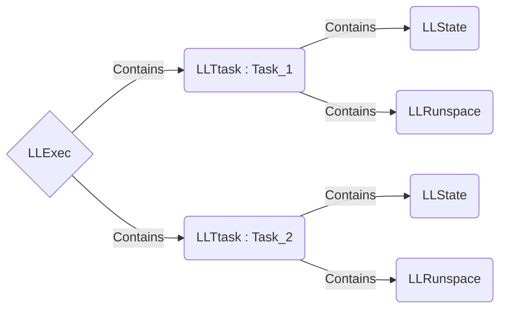

# LLTask v-0.4
Hello !
I Wanted to create an easy way of using runspaces to run concurrent tasks.
I ended up using runspacepool.
I've create some classes to make it more friendly and easy to use (i think ^^', works for me).
The name is not definitive.

# Files

- **LLExec.psm1** ⇒ Contains LLExec class
- **LLTask.psm1** ⇒ Contains LLTask class
- **LLRunspace.psm1** ⇒ Contains LLRunspace class
- **LLState.psm1** ⇒ Contains LLState class
- **ExampleModule_1** ⇒ Contains a function, used for demonstration in Runner.ps1
- **Runner.ps1** ⇒ Used for demonstration. Contains a litlle function.

## To Add

- History of the tasks to log it. YZY
- Sharing variable across LLTask. 
	- tried to use 
		> System.Management.Automation.Runspaces.SessionStateVariableEntry

		With
		> InitialSessionState.Variables.Add)
		
		⇒ not able to get it working
	- also tried 
		> RunspacePool.SessionStateProxy.SetVariable
	
		⇒ Also not working
- Some methods (clear runspacepool, replay a task ...)
- Better comments
- Beter errors gestions (already alerted when an error occur in a runspace)

## Little UML

## When running Runner.ps1 (In the powershell of visual studio code, terminal > run active file)

